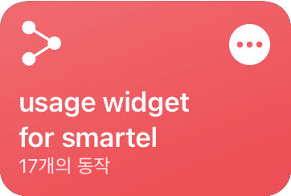
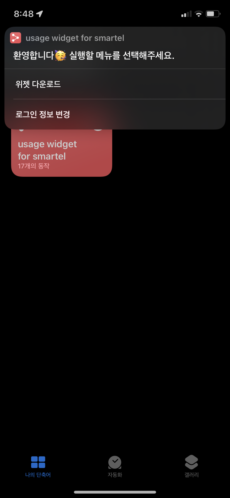
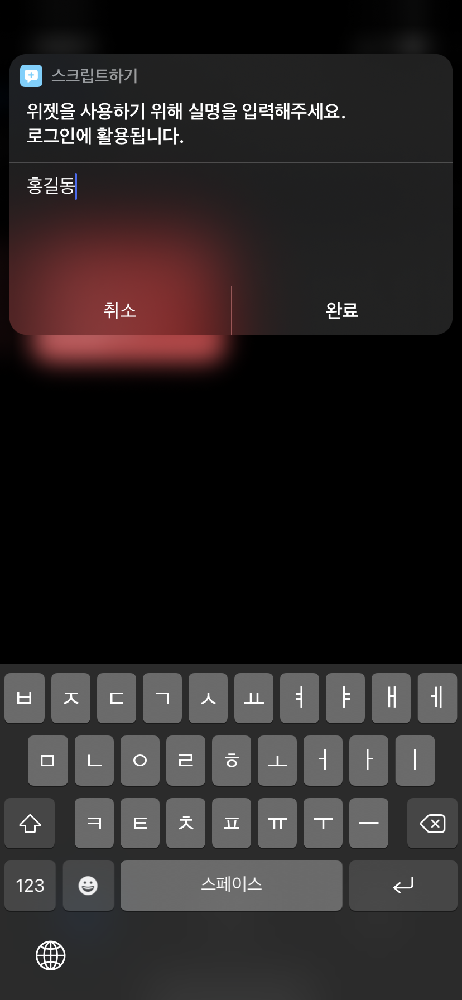
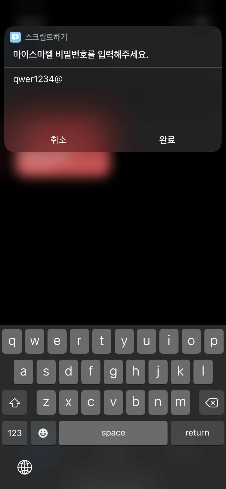
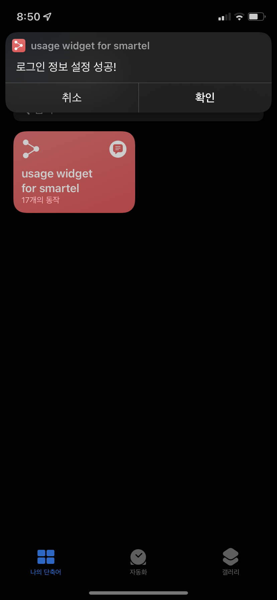
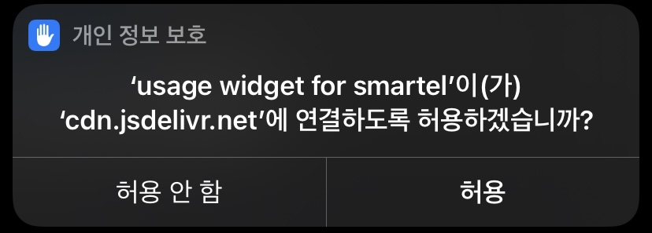
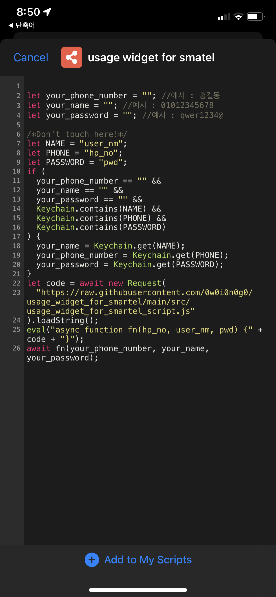
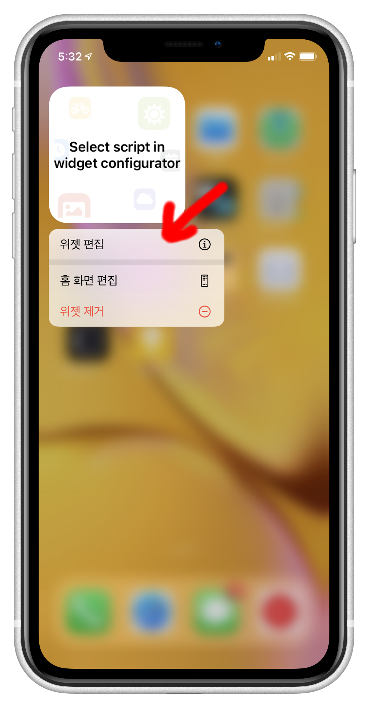
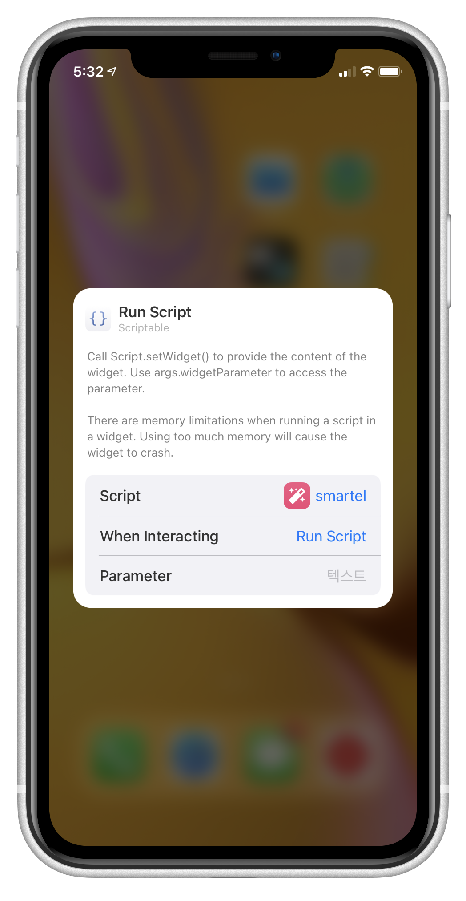

# 스마텔 알뜰폰 사용량 위젯

  

By_0w0i0n0g0

 
 

## 목차

[설치](#설치)

[사용](#사용)

[특징](#특징)

[설명](#설명)

[주의](#주의사항)

[기타](#기타)

 
 

## 설치

0. 마이스마텔에서 비밀번호 설정해주세요. (이미 설정되어 있다면 다음으로 넘어가기)

- https://www.smartelmobile.com:5009/mobile2/m_login.asp

  

---

1. 앱스토어에서 scriptable을 설치해주세요.

- https://apps.apple.com/us/app/scriptable/id1405459188

  

---

2. 아래 버튼을 눌러 단축어 다운로드 해주세요.

<a href="https://www.icloud.com/shortcuts/223b98c8c429474fa6d13d8cb414e63a">
  

    
  

</a>

---

3. 단축어를 실행하고 **위젯 다운로드** 메뉴를 선택해주세요. 그리고 설명에 맞게 로그인 정보를 작성해주세요.

  
  
  
  

- 로그인 정보가 설정되었다면 **로그인 정보 설정 성공!** 알림이 표시됩니다. **확인** 을 눌러주세요.

  

- 코드를 다운받기 위해 연결을 허용해주세요.

  

- scriptable앱에서 다운받은 위젯 코드가 열립니다. **Add to My Scripts** 버튼을 눌러 코드를 저장해주세요.

  

---

4. 위젯을 만들어주세요.

- 위젯 추가에서 scriptable을 선택해주세요.

- 원하는 사이즈를 선택해주세요.

  
  

---

5. 위젯을 꾹 눌러 위젯 편집 선택해주세요.

  

- script 항목에서 usage widget for smartel을 선택해주세요.

- When Interacting 항목에서 Run Script 선택해주세요.

  - 이 설정을 하면 위젯을 클릭하여 새로고침할 수 있습니다.

  
  

---

6. 축하드립니다! 🥳 모두 끝났어요!

 
 

## 사용

- 위의 과정대로 정상적으로 설치되었다면 위젯을 클릭하였을 때 앱이 켜지면서 바로 새로고침이 됩니다.
- 혹시 로그인이 풀리거나, 값이 이상하게 표시되거나, 잘 사용하다가 에러가 난다면 위젯을 클릭하거나 스크립트를 눌러 다시 실행해주세요.
- 애플의 위젯 정책에 따라 자동 새로고침이 되는 시점이 달라질 수 있습니다. (10분 이상 걸릴 때도 있습니다.)
- 위젯의 오른쪽 상단에 시간으로 새로고침 되었던 시점을 확인할 수 있습니다.
- 이 위젯에 표시되는 음성 + 영상은 일반적인 통화와 영상통화 부가통화 등이 모두 가능한 것을 의미합니다.
- 이 위젯에 표시되는 음성은 오직 음성통화만 가능한 것을 의미합니다. 보통 무제한 요금제에서 음성 + 영상을 따로 제공하고, 음성을 무제한으로 제공합니다.
- 이 위젯에 표시되는 데이터는 기본제공 데이터 + 일일제공 데이터가 합산된 값입니다.
- 제공량이 모두 소진되면 요금제에 따라 속도가 제한된 데이터가 제공되거나 추가요금이 부과됩니다.
- 설정 > 셀룰러 > Scriptable 앱 설정이 허용되어 있어야 LTE환경에서도 동작합니다.

 

- 이외 궁금한 점이나 피드백, 오류 등은 issues에 올려주세요.
- 유용하셨다면 Star를 눌러주세요!

 
 

## 특징

  
  

- 한눈에 알아볼 수 있는 사용량
- 아이폰의 라이트 모드 / 다크 모드에 맞게 변화
- 우측 상단에 새로고침된 시간 표시
- 요금제에 따라 표시 형식 변화

 
 

## 설명

과점시장인 통신업에서 2010년 3월 정부가 전기통신사업법을 통해 알뜰폰(MVNO)사업자가 요구할시, 망의 임대를 거부할 수 없게 하여 소비자가 이전보다 저렴하게 사용할 수 있도록 하였습니다.

그러나, 알뜰폰은 부실한 고객대응과 사용자 편의기능 부족이 단점으로 꼽히고 있습니다.

알뜰폰 "스마텔"을 사용하면서, 없어서 정말 불편했던 사용량 위젯을 만들어보았습니다.

 
 

## 주의사항

- 이 위젯은 해당 통신사와 어떠한 관계없이, 소비자의 편의를 위해 만들었습니다.
- 스마텔의 "실시간 제공량"을 제공하는 서버가 완전한 "실시간"으로 확인할 수 없게 새로고침되지 않습니다. 실제 사용량과 차이가 있을 수 있습니다.
- 로그인 시 필요한 전화번호, 이름, 비밀번호는 키체인으로 저장되어 로그인에만 사용됩니다.
- 전화번호, 이름, 비밀번호를 모두 정확히 입력해야 합니다. [설치](#설치)를 정확하게 따라해주십시오.
- scriptable앱은 iOS전용입니다.
- 현재 스마텔 LGU 요금제만 호환됩니다.
- ~~스마텔 SKT는 원하는 이용자가 실시간 사용량 조회 페이지의 html과 header 파일을 제공하면 제작 가능합니다. 제공하고 싶다면 issues에 업로드 해주세요.~~ (보류 중)

 
 

## 기타

 

### 로드맵

- [x] 한글 인코딩 기능 구현
- [x] 무제한 요금제 지원
- [x] 3가지 크기에 맞춰 구현
- [x] 새로고침된 시간 표시
- [ ] 널부러져 있는 코드들 리팩터링
- [ ] skt용 로그인 코드 제작
- [x] 편리한 설치 및 사용을 위한 단축어 제작
- [x] 보안을 위한 keychain 설정

 

### 테스트 된 요금제

- USIM 스마트 심플(100분+1.5GB) 정상작동 확인
- 우주 LTE데이터(11GB+) 정상작동 확인
- USIM 심플(50분+1.8GB) 정상작동 확인

 

### 버전

- v.0

  - USIM 스마트 심플(100분+1.5GB) 최적화
  - small 위젯에만 적용 가능
  - 인코딩 오류로 직접 인코딩된 코드로만 로그인 가능

- v.1

  - 우주 LTE데이터(11GB+) 작동 확인
  - 이외 다양한 요금제도 불러올 수 있도록 데이터 파싱
  - euc-kr을 urlencoder.org을 통해 인코딩, 한글 이름 입력만으로 로그인 가능
  - 3가지 크기의 위젯 모두에 알맞게 디자인

- v.2
  - 단축어를 통한 편리한 설치과정 및 사용
  - Scriptable keychain을 통한 보안과 개인정보 관리
  - 위젯 자체에 euc-kr 인코딩 함수를 내장하여 속도 향상
