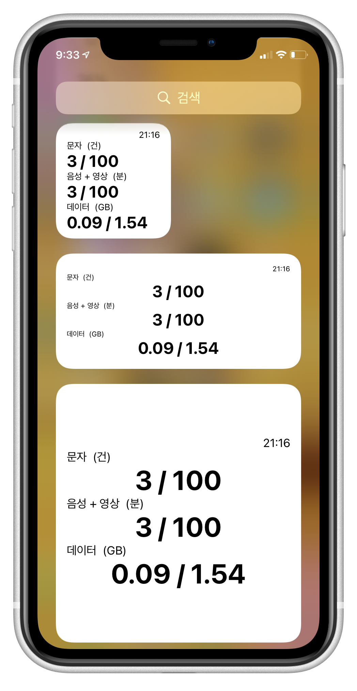
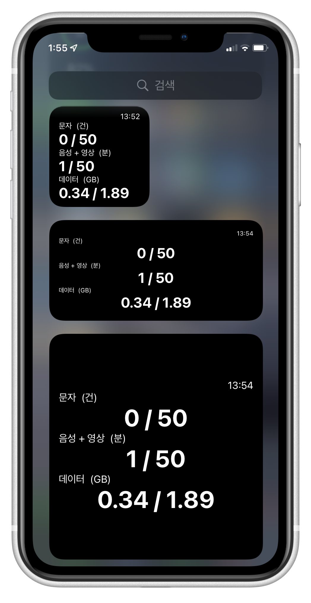
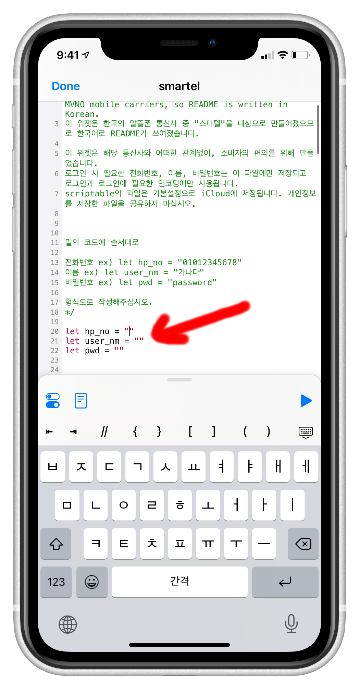
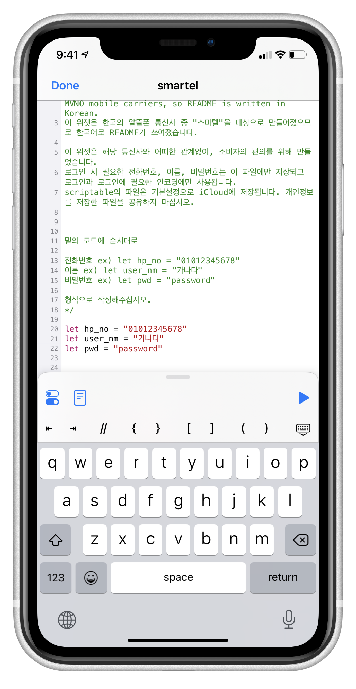
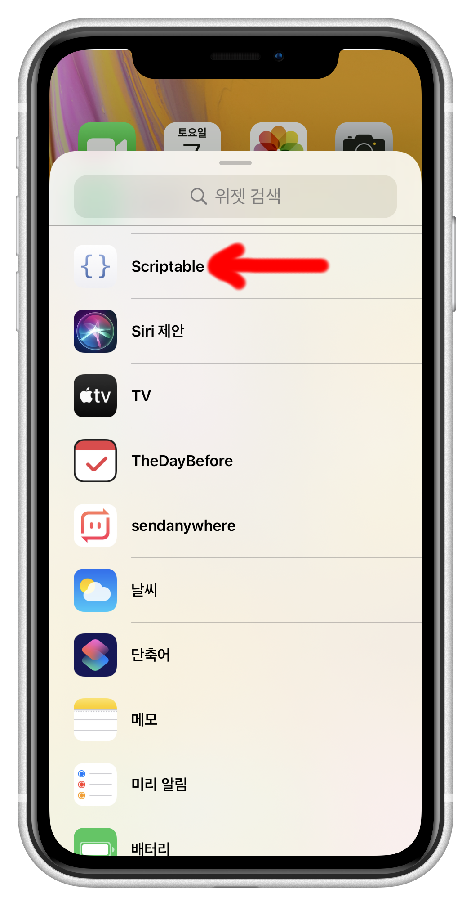

# [scriptable] smartel_MVNO_mobile_plan_usage_widget
# [scriptable] 스마텔_알뜰폰_사용량_위젯


<br>
<br>

## Table of Contents
[알림](#alert)

[설명](#description)

[특징](#feature)

[주의](#warning)

[설치](#installation)

[사용](#usage)


<br>

<p align="center">
  
</p>

## Alert
- This widget is for "Smartel" among South Korea's MVNO mobile carriers, so README is written in Korean.

- 이 위젯은 한국의 알뜰폰 통신사 중 "스마텔"을 대상으로 만들어졌으므로 한국어로 README가 쓰여졌습니다.

- scriptable앱은 iOS전용입니다.

- 현재 스마텔 LGU만 호환됩니다. (USIM 스마트 심플(100분+1.5GB)와 우주 LTE데이터(11GB+)요금제로 테스트 완료)

- 스마텔 SKT는 원하는 이용자가 실시간 사용량 조회 페이지의 html과 header 파일을 제공하면 제작 가능합니다. 제공하고 싶다면 issues에 업로드 해주세요.

- 업데이트 예정인 추가 기능들은 [여기서](#todo) 확인 가능합니다. 아이디어를 제공하고 싶다면 issues에 업로드 해주세요.


<br>
<br>

## Description
과점시장인 통신업에서 2010년 3월 정부가 전기통신사업법을 통해 알뜰폰(MVNO)사업자가 요구할시, 망을 임대를 거부할 수 없게 하여 소비자가 이전보다 저렴하게 사용할 수 있도록 하였습니다.

그러나, 알뜰폰은 저렴한 가격대신 부실한 고객대응과 사용자 편의기능 부족이 단점으로 꼽히고 있습니다.

알뜰폰 사업자 중 "스마텔"을 사용하면서, 없어서 정말 불편하다고 느꼈던 사용량 위젯을 만들어보았습니다.

<br>
<br>

- 이 위젯에 표시되는 음성 + 영상은 일반적인 통화와 영상통화 부가통화 등이 모두 가능한 것을 의미합니다.
- 이 위젯에 표시되는 음성은 오직 음성통화만 가능한 것을 의미합니다. 보통 무제한 요금제에서 음성 + 영상을 따로 제공하고, 음성을 무제한으로 제공합니다.
- 이 위젯에 표시되는 데이터는 기본제공 데이터 + 일일제공 데이터가 합산된 값입니다. 
- 제공량이 모두 소진되면 요금제에 따라 속도가 제한된 데이터가 제공됩니다.

<br>
<br>

## Feature
<p align="center">
  
</p>


- 아이폰의 라이트 모드 / 다크 모드에 맞게 변화
- 우측 상단에 새로고침된 시간 표시
- 요금제에 따라 표시 형식 변화

<br>
<br>

## Warning
- 이 위젯은 해당 통신사와 어떠한 관계없이, 소비자의 편의를 위해 만들었습니다.

- 스마텔의 "실시간 제공량"을 제공하는 서버가 "실시간"으로 확인할 수 없게 새로고침되지 않습니다. 실제 사용량과 최대 10분 정도 차이날 수 있습니다.
[테스트 결과 보기](#tests)

- 로그인 시 필요한 전화번호, 이름, 비밀번호는 이 파일에만 저장되고 로그인에만 사용됩니다.

- scriptable의 파일은 기본설정으로 iCloud에 저장됩니다. 개인정보를 저장한 파일을 공유하지 마십시오.

- 위젯을 사용하려먼 iCloud가 활성화 되어야 합니다. 활성화되어 있는지 확인하십시오.

- 설치된 파일에 전화번호, 이름, 비밀번호를 모두 정확히 입력해야 합니다. [설치](#installation)를 정확하게 따라해주십시오.


<br>
<br>


## Installation

---
0. 마이스마텔에서 비밀번호 설정 (이미 설정되어 있다면 다음으로 넘어가기)
    - https://www.smartelmobile.com:5009/mobile2/m_login.asp


<p align="center">
  
</p>

---

1. 앱스토어에서 scriptable을 다운
    - https://apps.apple.com/us/app/scriptable/id1405459188?ign-mpt=uo%3D4

<p align="center">
  
</p>

---
2. scriptable 앱을 열고, 상단의 +버튼을 누른후 밑의 스크립트를 복사하여 붙여넣기

```

var fm = FileManager.iCloud()
var code = await new Request("https://han.gl/PadZQ").loadString()
fm.writeString(fm.joinPath(fm.documentsDirectory(), "smartel_By_0w0i0n0g0.js"), code)
return 0

```

<p align="center">
<a herf="">

</a>
<p>

- 
  - Done을 눌러 나온 후, 스크립트를 눌러 실행하고 조금 기다리면 "smartel_By_0w0i0n0g0"가 생성됨

<p align="center">
<a herf="">

</a>
<p>

---
3. scriptable 앱을 열고, smartel 옆의 점 세개를 눌러 편집

<p align="center">
  
</p>

- 
    - 제일 위의 코드에 순서대로

    - 전화번호 ex) let hp_no = "전화번호(-없이)"

    - 이름 ex) let user_nm = "본인의 이름"

    - 비밀번호 ex) let pwd = "마이스마텔에 등록한 비밀번호"

    - 형식으로 작성해주십시오.


<p align="center">
  
</p>

---
4. 위젯 추가에서 scriptable 선택
    - 위젯 선택

<p align="center">
  
</p>

---

5. 위젯을 꾹 눌러 위젯 편집 선택

<p align="center">
  
</p>

- 
    - script에서 smartel_By_0w0i0n0g0 선택
    - When Interacting에서 Run Script 선택
        - 이 설정을 하면 위젯을 클릭하여 새로고침할 수 있습니다.

<p align="center">
  
</p>


<br>
<br>

## Usage
- 위의 과정대로 정상적으로 설치되었다면 위젯을 클릭하였을 때 바로 새로고침이 가능합니다.
- 애플의 위젯 정책에 따라 자동 새로고침이 되는 시점이 달라질 수 있습니다. (120초로 설정됨.)
- 위젯의 오른쪽 상단에 시간으로 새로고침된 시점을 확인할 수 있습니다.
- 이외 궁금한 점이나 피드백, 오류 등은 issues에 올려주세요.
- Star는 사랑입니다.

<br>
<br>

---

<br>
<br>
<br>
<br>


### Todo

- [X] 한글 인코딩 기능 구현
- [ ] 무제한 요금제 지원
- [ ] 3가지 크기에 맞춰 구현
- [X] 새로고침된 시간 표시
- [ ] 널부러져 있는 코드들 함수로 묶어 구현

<br>

### Tests

- 실시간 제공량 서버의 새로고침 시간 테스트
  - 1차 테스트 결과

    - 3시 8분 : 문자 1건 보냄.

    - 3시 15분 : 실시간 제공량 페이지에서 문자 1건 차감됨.

  - 2차 테스트 결과

    - 3시 18분 : 문자 1건 보냄.

    - 3시 25분 : 실시간 제공량 페이지에서 문자 1건 차감됨.

  - 결론
    - 실시간 제공량이 서버에서 매 x5분 기준으로 새로고침 되는 것으로 보임. 

- 요금제 테스트
  - USIM 스마트 심플(100분+1.5GB) 정상작동 확인.
  - 우주 LTE데이터(11GB+) 정상작동 확인.

<br>

### Vesions

- v.0
  - USIM 스마트 심플(100분+1.5GB) 최적화
  - small 위젯에만 적용 가능
  - 인코딩 오류로 직접 인코딩된 코드로만 로그인 가능

- V.1
  - 우주 LTE데이터(11GB+) 작동 확인
  - 이외 다양한 요금제도 불러올 수 있도록 데이터 파싱
  - euc-kr을 urlencoder.org을 통해 인코딩, 변수만으로 로그인 가능
  - 3가지 크기의 위젯 모두에 알맞게 디자인